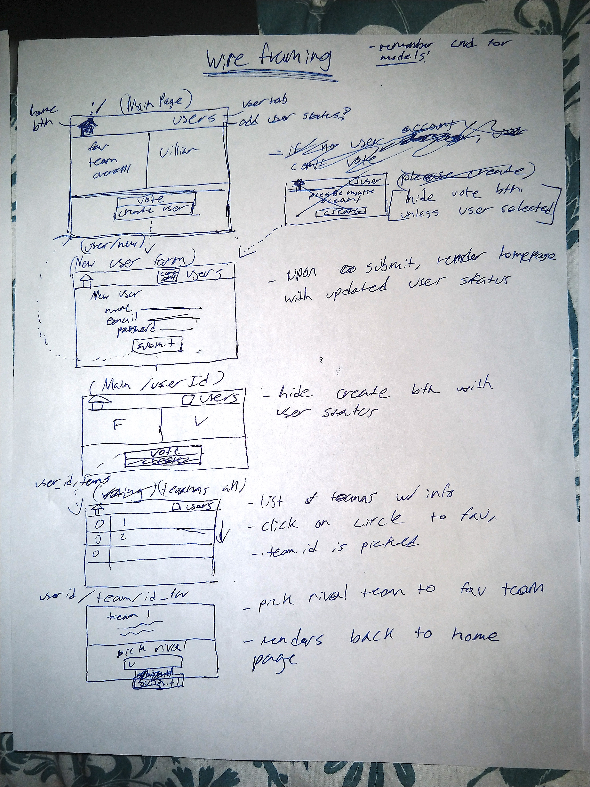
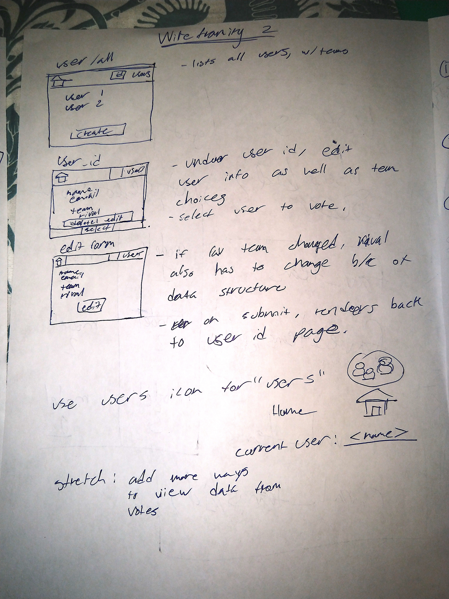
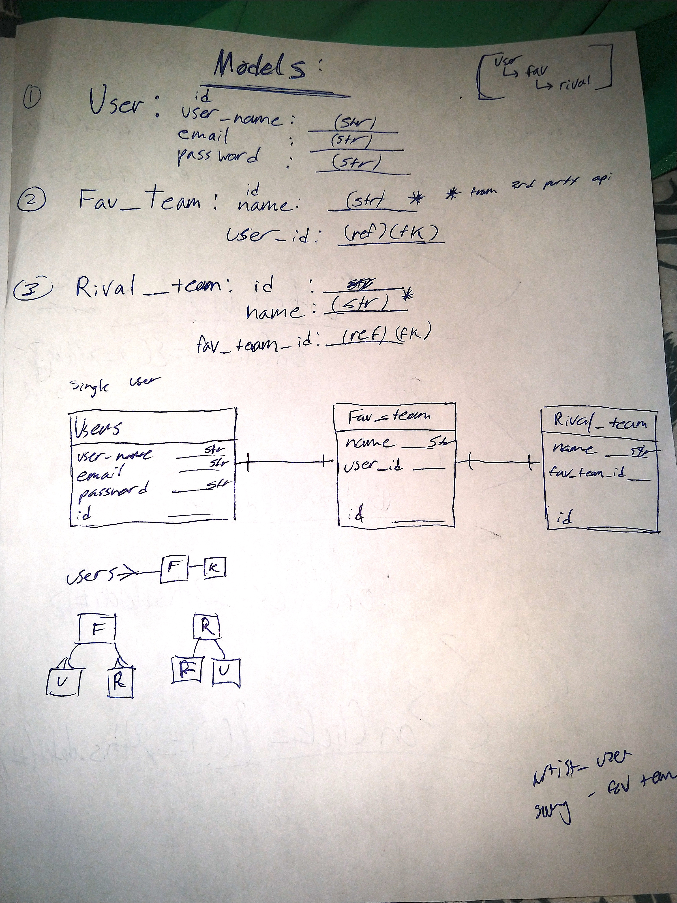
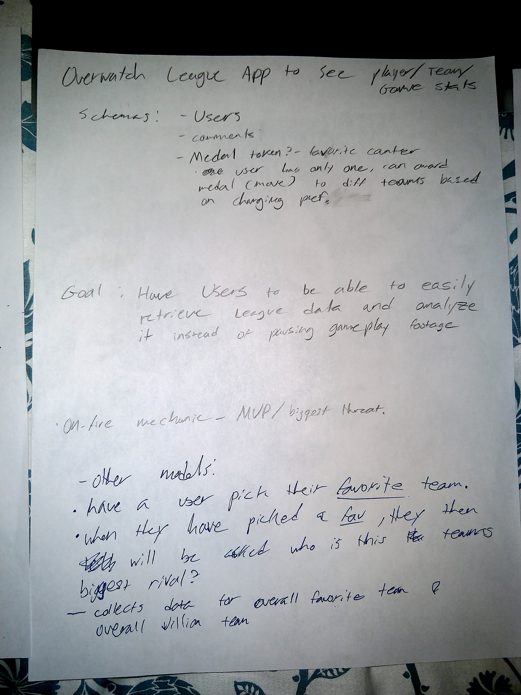
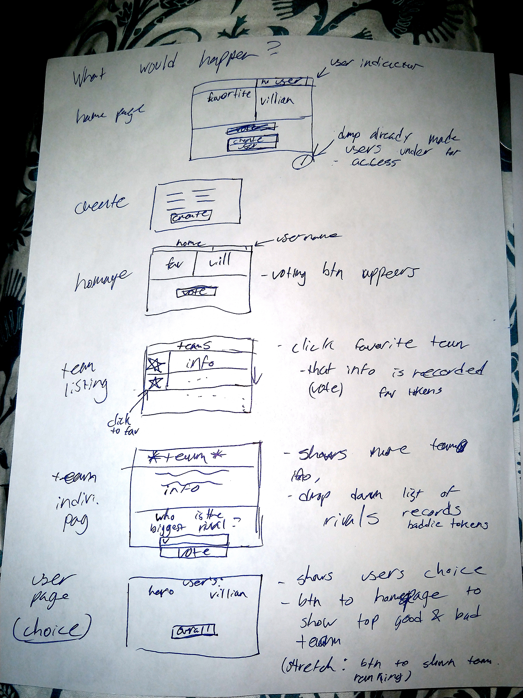

# SEI-Project-4-Esport

## Overview

For project #4, I created a website with a remote database where the user can perform CRUD on the model User, add and delete favorite team data nested within the User data, and add and delete favorite teams to a list from a 3rd party API called PandaScore.

This app differs greatly from the inital planning stages due to time constraints and inexperience. The third party API connection was very difficult. The original idea was to have users create an account and pick a favorite team from a list of teams provided by the third party API. They then would pick what that user thought was their favorite team's biggest rival was. With multiple users entering in fav. teams and rival teams, I would then query for that data and display the most popular team and the biggest rival team on the home page.

**Live Site:** <https://eteamonline.herokuapp.com/>

## Technologies Used

  * Languages - HTML5, CSS3, Javascript, Python
  * Libraries - React, Django, MongoDB, SQL, Node
  * Project Planning & User Stories - [Trello](https://trello.com/b/fS8hPYmS/sei-project-four)
  * Sublime Text 3

## Features

  * CRUD
  * Web Navigation

## Prework

## Future Development

  * Restructure data and components to original idea
  * Fix minor bug in adding OWL Teams Function (PandaTeamsList.js)
  * Add User Login
